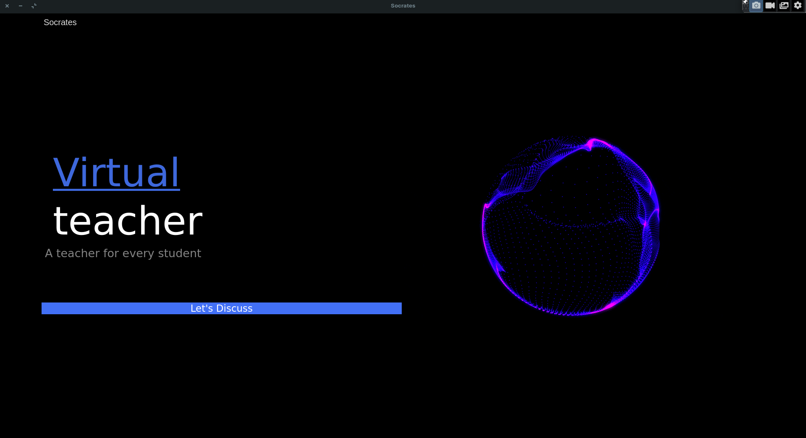
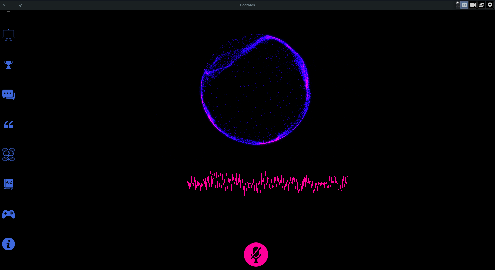
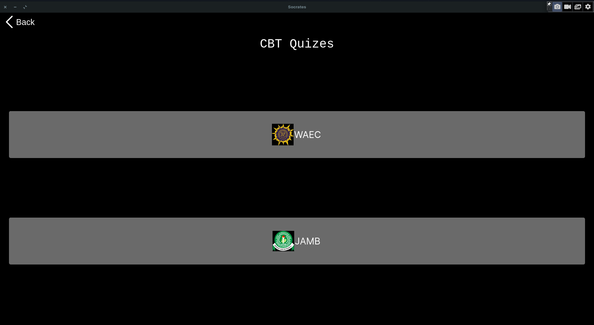
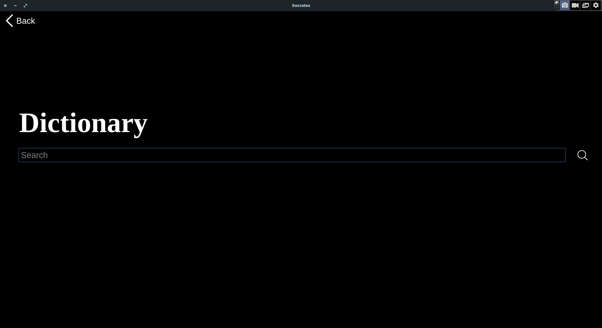

# Foreground extractor
---
## Landing Page



## Page where you communicate with the teacher



## Quiz Page



## Dictionary Page




## Description
---
This is an AI powered application that was built with the intention to make learning a lot easier. It is able to simulate a teacher by allowing you to ask for explanation of any topic of your choice. It then gives an explanation and allows you to ask for further explanation. If you ask for further explanation, it explains it further.

## Motivation
---
The National Policy on Education stipulates that the teacher-pupil ratio should be 1:40. However, according to the UNESCO International Bureau of Education, the ratio has been exceeded in most schools, especially in urban areas. Statistics show that the teacher-pupil ratio in some parts of the country is 1:73. The disparity in the distribution of these indicators between urban and rural areas impose serious limitations to the goal of achieving the much deserved educational transformation of the society in general.”

This application intends to solve that problem by providing a teacher for every student


## Running the code
---
If you want to run the code with the default parameters (default images) run the code with the command:

```bash
python main.py
```

or

```bash
python3 main.py
```


## Navigating the application
---

- When you run the `main.py` file a landing page appears.
- On the landing page click on the "Let's discuss" button to tae you to the next page
- To ask a question, click on the button with the microphone icon. a "Listening" text appears somewhere at the left side of the screen
- While the "Listening" is still being displayed, you can ask any question. e.g "What is biology", "explain photosyntheis"
- When you are done speaking, wait for the "Listening" text to disappear. You do not have to click on the microphone button again.
- When it asks you if you want further explanation, you can click on the microphone button and answer either yes or no.

> **Note**: When communicating withe the virtual teacher, if you start your sentence with **"what is"** or **"explain"** or similar sentences, it will give you a detailed explanation. If you start your sentence with **"define"**, it will only give a definition . It also supports greetings.


## Features of the application
---
- The virtual teacher (completed)
- A dictionary
- A quiz section containing questions and answers to popular exams such as WAEC and JAMB (still under development)
- A whiteboard
- Discussion rooms for students to interact with other students who use the application.
- A platform for students to upload and share eduational materials which will then be available to all students using the platform 

Feature | Completed
:------------ | :-------------
Virtual Teacher | :heavy_check_mark:
Dictionary | :heavy_check_mark:
A quiz section containing questions and answers to popular exams such as WAEC and JAMB | &cross;
Whiteboard | :heavy_check_mark:
Discussion rooms for students to interact with other students who use the application.| &cross;
A platform for students to upload and share eduational materials which will then be available to all students using the platform | &cross; 

